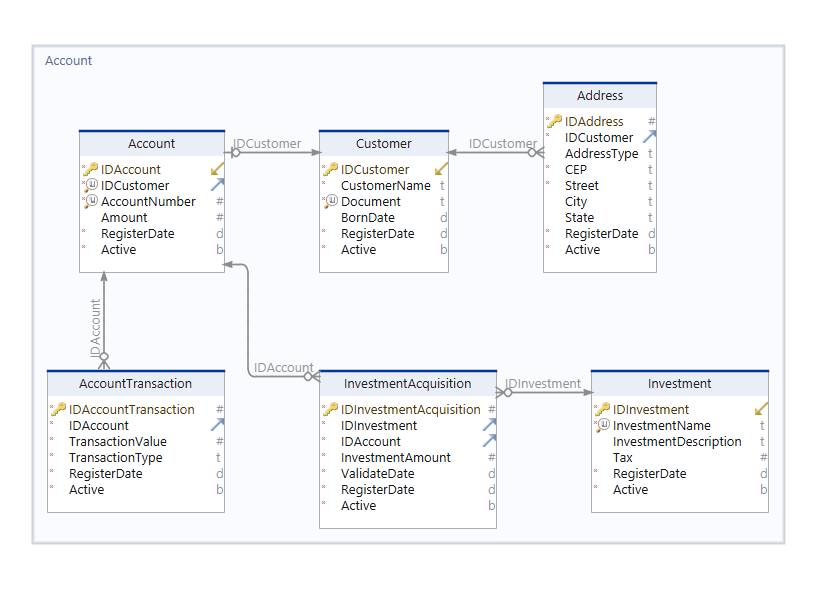

# Fintech Architecture

Use case of a fintech that was expanding your data architecture to NoSQL databases for supply high demand of analytics by his directors.

### Fisrt version of tables organization - Relational Databse

The main data will be extracted from transactional database that is connected on FinAPP, responsable for manage transactions from customers, and his investments.

The chosen relational database is SQL Server, because it's a robuste database to storage a petabyte data size. At fist the quantity of transactions is not big enough to clusterize the database and distribute data between many servers.